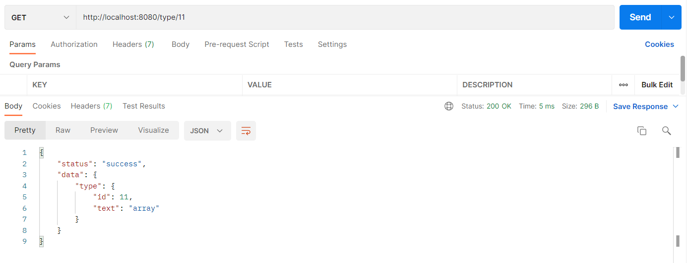
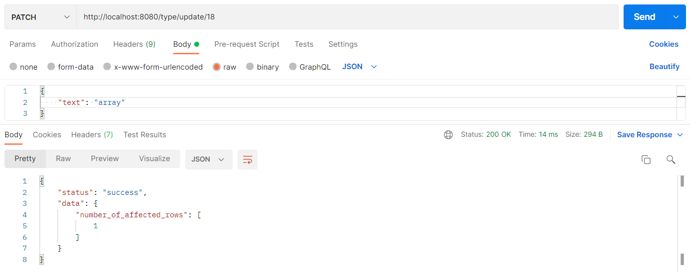
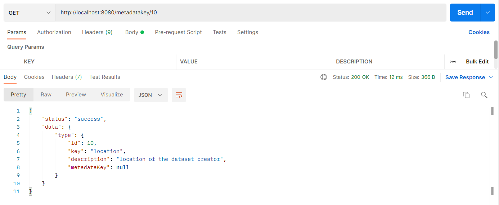
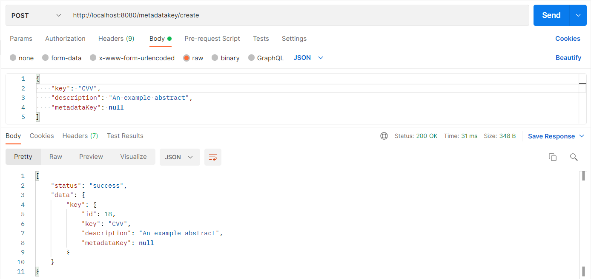
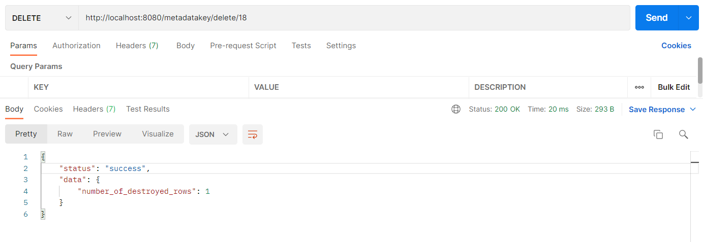
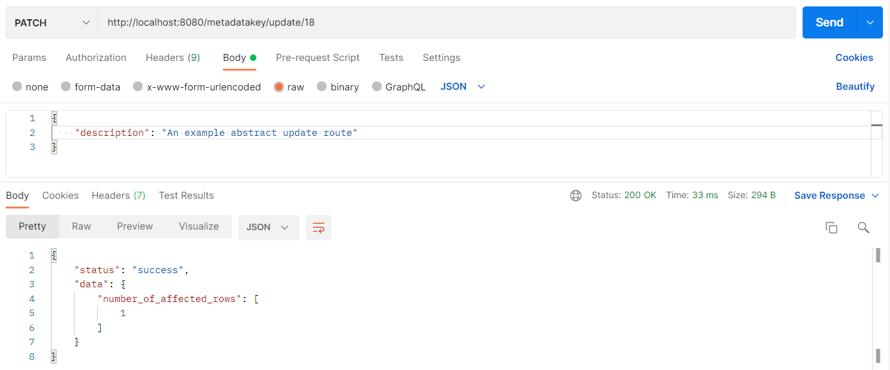

# Тестування працездатності системи

- `/type/all` - Отримати список всіх типів

- `/type/:id` - Отримати тип за унікальним ідентифікатором

- `/types/create` - Cтворити новий тип

- `/types/delete/:id` - Видалити тип за унікальним ідентифікатором

- `/types/update/:id` - Оновити тип за унікальним ідентифікатором

- `/metadatakey/all` - Отримати список всіх ключів метаданих

- `/metadatakey/:id` - Отримати ключ метаданих за унікальним ідентифікатором

- `/metadatakey/create` - Cтворити новий ключ метаданих

- `/metadatakey/delete/:id` - Видалити ключ метаданих за унікальним ідентифікатором

- `/types/update/:id` - Оновити ключ метаданих за унікальним ідентифікатором

